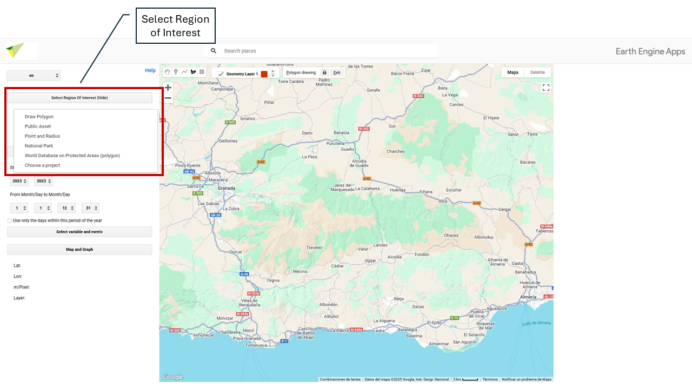
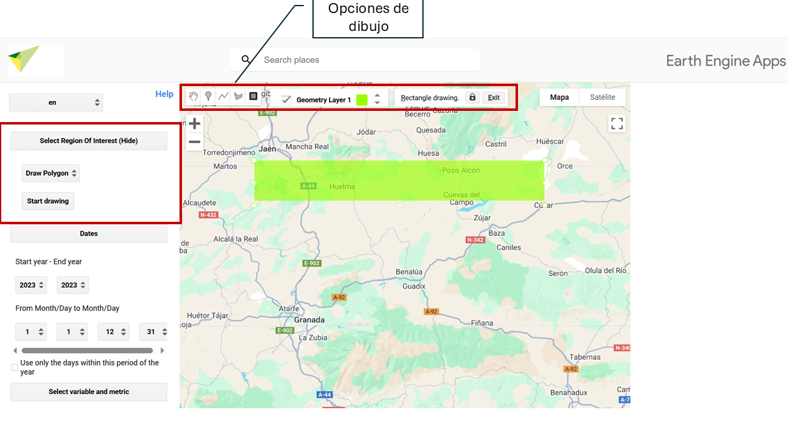
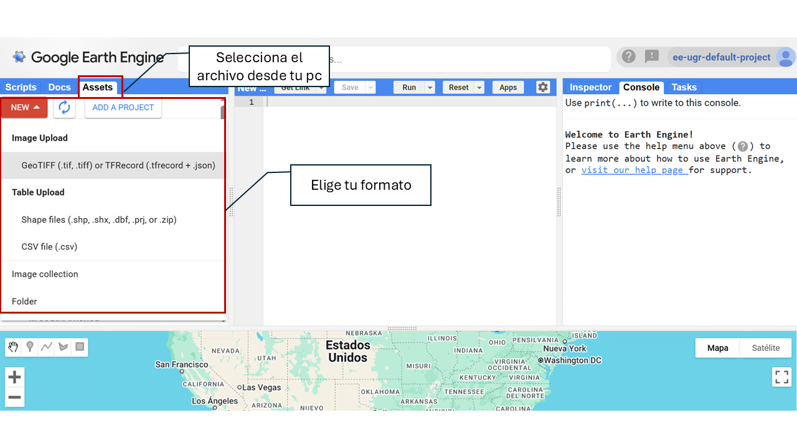
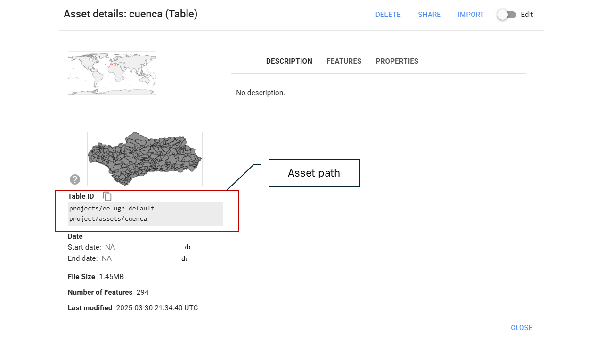
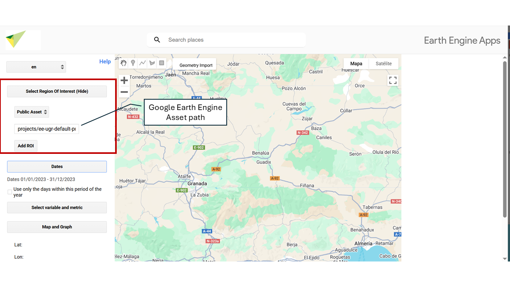
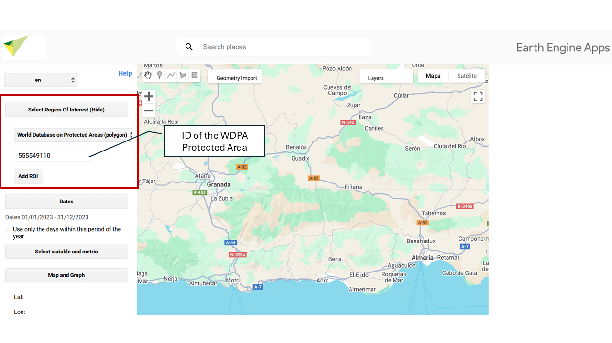

# Study Area {#area-estudio}

**Select ROI – Choose your study area.**  

In this section you can define the **Region of Interest (ROI)** on which the analysis will be carried out. Several options are available for selecting or uploading your study area. By default, the tool is set to draw custom polygons. To change the type of geometry (for example, to point or rectangle), go to the drawing options menu before defining the region of interest.

## **🖊️ Draw your Region of Interest (ROI – Region of Interest)**

You can manually draw regions using this option. When you draw a region (point, line, or polygon), it is stored as a Geometry object that will appear as a layer in the upper left part of the map.

## 📂 **Using a Public or Personal Asset**

To upload an asset (such as your study area, e.g., a shapefile), you need an active **Google Earth Engine (GEE)** account. If you do not yet have an account, you can easily create one by following this step-by-step guide: [How to register in Google Earth Engine](https://ecoinfugr.github.io/ecoinformatica/sesiones/teledeteccion/register_GEE_jml.html).

Once your account is active, you will be able to upload your own spatial data to GEE by following these steps:

### Access the upload tool

1. Go to [Google Earth Engine Code Editor](https://code.earthengine.google.com).  
2. In the left-hand corner, click the **Assets** icon.  
3. Click the **NEW** button.  

### Upload the file

1. Choose the file type: **Image (raster)** or **Table (vector)**.  
2. Select the file from your computer.  
3. Define the **destination folder** within your assets (example: `users/your_user/my_asset`).  
4. Click **UPLOAD**.  

### Wait for processing

- The file will go through an **upload process**.  
- You can check the status in the **Tasks** section.  
- Once processed, the asset will be available in your GEE account.  

### Use the asset in MonitorEO

Once uploaded, make sure to:  

* Correctly copy and paste this path so the resource can be loaded without errors.  

* Share the asset as public.  

Next, exit GEE and return to the MonitorEO app. There, indicate the asset path, i.e., the unique address where the resource is stored within your GEE account.  
This path usually has the following format:  

* **`users/your_user/asset_name`**  

## **📌 Specific Point and Buffer**

You can enter **latitude** and **longitude** coordinates to define an exact location on Earth’s surface. From that point, a circular area (**buffer**) can be generated whose **radius, in meters, is defined by the user**. This functionality allows you to delimit areas of interest around a specific point for analysis.  

- Latitude: Enter the latitude in decimal format (for example: -37.6009).  
Use a period (.) as the decimal separator. Do not use commas or additional symbols.  

- Longitude: Enter the longitude in decimal format (for example: -63.854).  
It must also be in decimal format with a period. Remember to use the negative sign if necessary.  

- Radius: Enter the radius in meters (for example: 1000 for one kilometer).  

## **🏞️ National Park**

You can select any of the **National Parks of Spain and Portugal** available on the platform as your study area.  

## **🌍 World Database on Protected Areas (WDPA)**

The World Database on Protected Areas (WDPA) is the most comprehensive and up-to-date source of geospatial information on protected areas worldwide. Managed by UN Environment and the World Conservation Monitoring Centre (UNEP-WCMC), it provides detailed data on national parks, nature reserves, and other protected areas.

To select a protected area by its ID, you can access the database through the official Protected Planet website ([🔗 protectedplanet.net](https://www.protectedplanet.net/)). There, you can search protected areas by name, country, or protection category and obtain their unique identifier (WDPA ID).

  

## **📁 Choose a Project**

You can also select as study area the zones associated with the different projects developed within the framework of **OBSNEV**. Each of them defines specific areas with different thematic focuses:

* **EarthCul**: Socioeconomic influence areas of mountain National Parks in Spain and Portugal.  
* **EVEREST**: Mountain National Parks of Spain and Portugal.  
* **PRESINMED**  
* **BioRefuges**  

