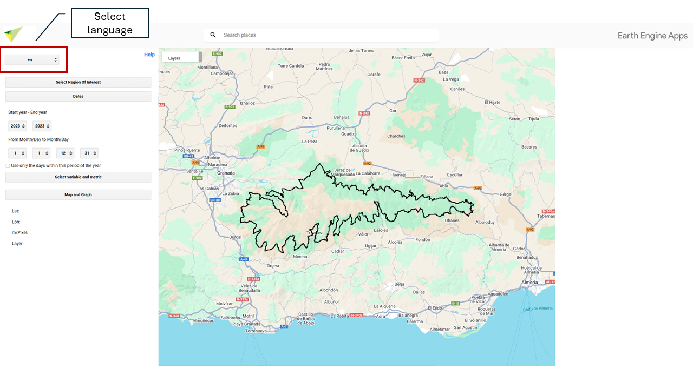
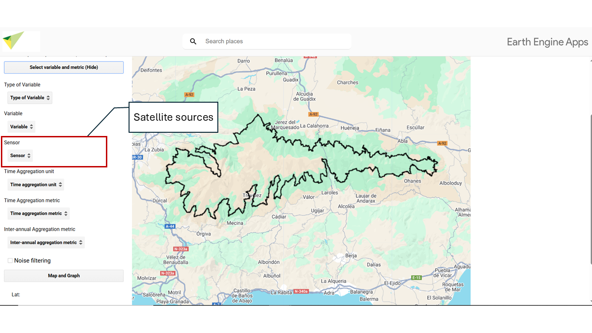
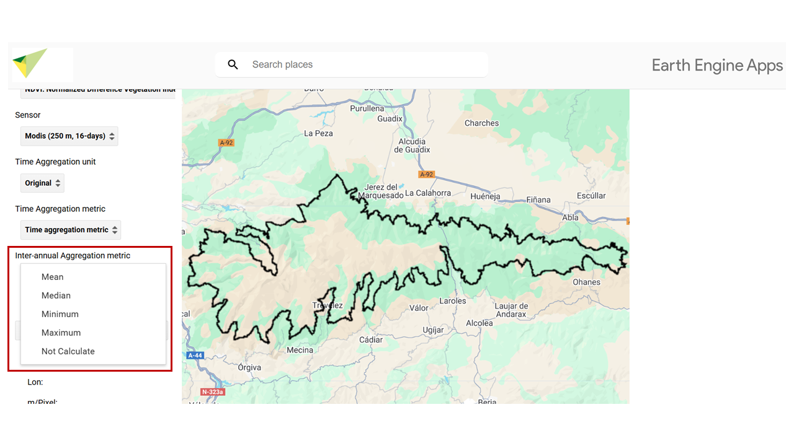
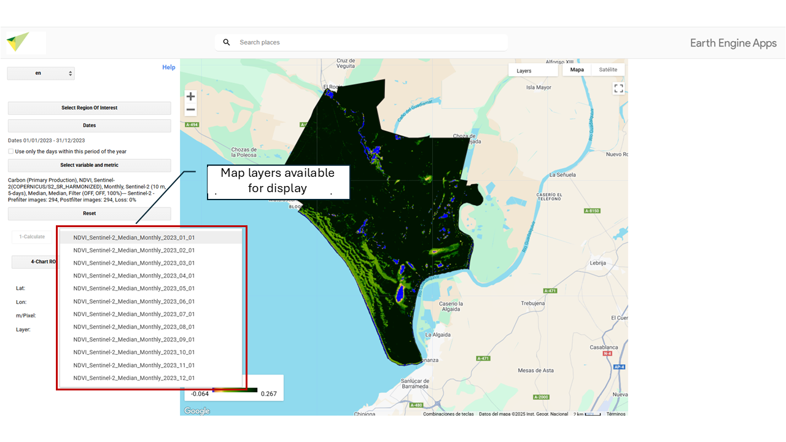
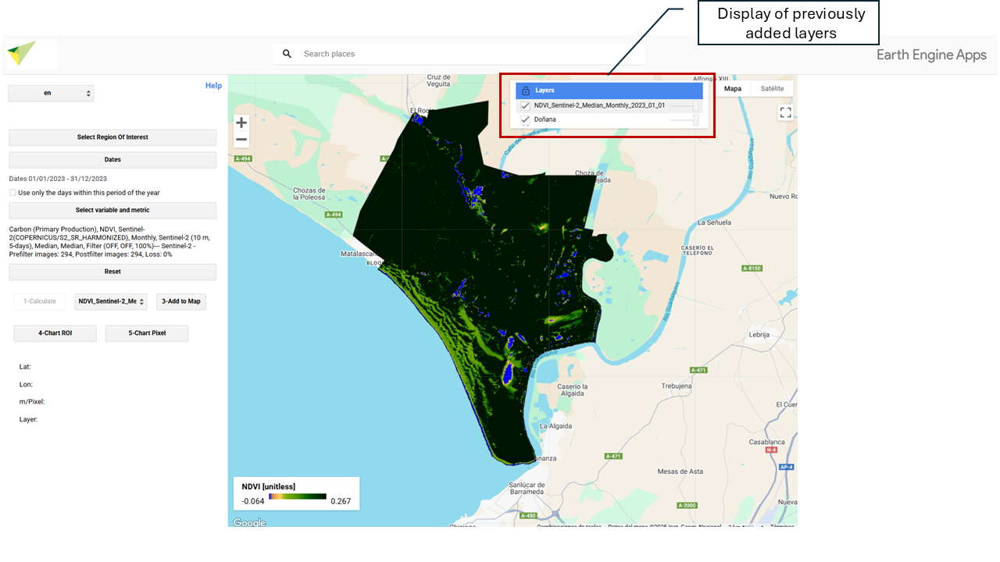
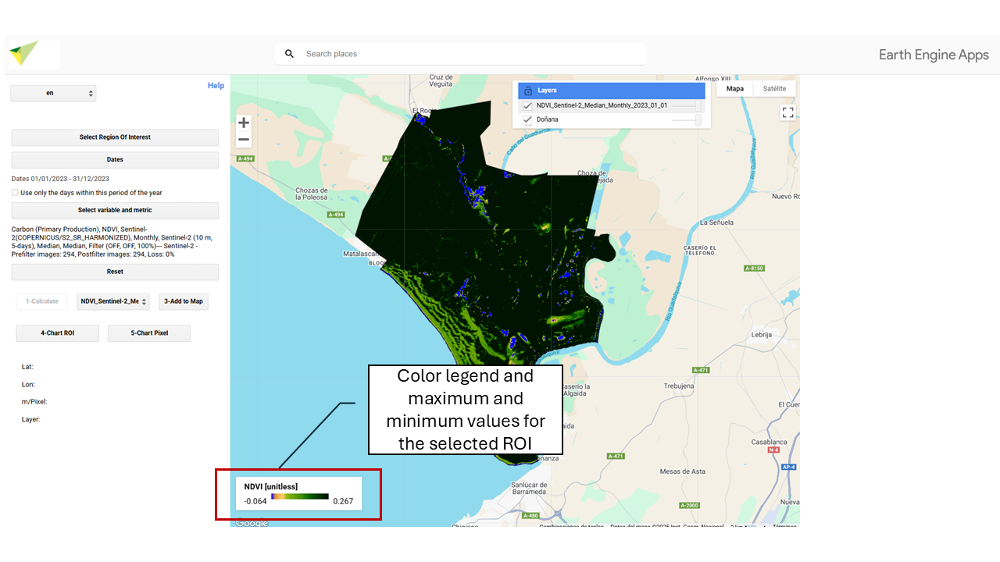

--- 
title: "MonitorEO-OBSNEV user manual"
author: "Cazorla, P.B., Guerrero, P., Alcaraz-Segura, D., Navarro, C., Bello, T., Postma, T., Zamora, R., Martínez-López, J."
date: "`r Sys.Date()`"
site: bookdown::bookdown_site
output: bookdown::gitbook
documentclass: book
bibliography: [book.bib, packages.bib]
biblio-style: apalike
link-citations: yes
github-repo: monitoreo-obsnev/manual
description: "User manual of the MonitorEO-OBSNEV tool"
---

# Introduction {#intro}

[MonitorEO-OBSNEV](https://sl.ugr.es/monitoreoobsnev) is a tool for analyzing satellite remote sensing–derived variables, based on Google Earth Engine, developed by the Sierra Nevada Global Change Observatory (University of Granada).

This user manual provides a comprehensive guide to the use of MonitorEO-OBSNEV, including a description of its functionalities, interface navigation, parameter selection, and results visualization.

This project has been developed within the framework of the work carried out by the Sierra Nevada Global Change Observatory, University of Granada, through the following projects:

- **EVEREST (PID2023-151939OB-I00)**, funded by the Ministry of Science, Innovation and Universities (MICIU) / State Research Agency (AEI) 10.13039/501100011033, and co-funded by the European Regional Development Fund (ERDF – European Union).

- **“Earth observations for the characterisation and monitoring of ecosystem functioning in Sierra Nevada (Spain)” (C-EXP-074-UGR23)**, co-funded by the ERDF 2014–2020 Program and the Regional Ministry of Economy, Knowledge, Enterprises and Universities of the Government of Andalusia.

<!--chapter:end:index.Rmd-->

# MonitorEO-OBSNEV Interface {#interfaz}

The graphical interface of the **MonitorEO-OBSNEV Virtual Research Laboratory** (*Monitoring with Earth Observations* of the **Sierra Nevada Global Change Observatory**) provides access to an advanced monitoring and alert system based on remote sensing data.

This system has been designed for the observation, analysis, and assessment of **Essential Biodiversity Variables (EBVs)** related to ecosystem functioning and structure. The interface enables spatial and temporal exploration of these variables in different regions of the planet, with special emphasis on protected mountain areas.

MonitorEO-OBSNEV integrates satellite data collections, geospatial analysis tools, and an interactive interface that facilitates its use both in scientific studies and in management applications.

<!--chapter:end:01-interfaz.Rmd-->

# Languages {#idiomas}

🌐 Select the interface language. The following options are available:

- **es**  
Spanish  

- **en**  
English  

- **fr**  
French  

- **de**  
German  

<!--chapter:end:02-idioma.Rmd-->

# Study Area {#area-estudio}

**Select ROI – Choose your study area.**  

In this section you can define the **Region of Interest (ROI)** on which the analysis will be carried out. Several options are available for selecting or uploading your study area. By default, the tool is set to draw custom polygons. To change the type of geometry (for example, to point or rectangle), go to the drawing options menu before defining the region of interest.

## **🖊️ Draw your Region of Interest (ROI – Region of Interest)**

You can manually draw regions using this option. When you draw a region (point, line, or polygon), it is stored as a Geometry object that will appear as a layer in the upper left part of the map.

## 📂 **Using a Public or Personal Asset**

To upload an asset (such as your study area, e.g., a shapefile), you need an active **Google Earth Engine (GEE)** account. If you do not yet have an account, you can easily create one by following this step-by-step guide: [How to register in Google Earth Engine](https://ecoinfugr.github.io/ecoinformatica/sesiones/teledeteccion/register_GEE_jml.html).

Once your account is active, you will be able to upload your own spatial data to GEE by following these steps:

### Access the upload tool

1. Go to [Google Earth Engine Code Editor](https://code.earthengine.google.com).  
2. In the left-hand corner, click the **Assets** icon.  
3. Click the **NEW** button.  

### Upload the file

1. Choose the file type: **Image (raster)** or **Table (vector)**.  
2. Select the file from your computer.  
3. Define the **destination folder** within your assets (example: `users/your_user/my_asset`).  
4. Click **UPLOAD**.  

### Wait for processing

- The file will go through an **upload process**.  
- You can check the status in the **Tasks** section.  
- Once processed, the asset will be available in your GEE account.  

### Use the asset in MonitorEO

Once uploaded, make sure to:  

* Correctly copy and paste this path so the resource can be loaded without errors.  

* Share the asset as public.  

Next, exit GEE and return to the MonitorEO app. There, indicate the asset path, i.e., the unique address where the resource is stored within your GEE account.  
This path usually has the following format:  

* **`users/your_user/asset_name`**  

## **📌 Specific Point and Buffer**

You can enter **latitude** and **longitude** coordinates to define an exact location on Earth’s surface. From that point, a circular area (**buffer**) can be generated whose **radius, in meters, is defined by the user**. This functionality allows you to delimit areas of interest around a specific point for analysis.  

- Latitude: Enter the latitude in decimal format (for example: -37.6009).  
Use a period (.) as the decimal separator. Do not use commas or additional symbols.  

- Longitude: Enter the longitude in decimal format (for example: -63.854).  
It must also be in decimal format with a period. Remember to use the negative sign if necessary.  

- Radius: Enter the radius in meters (for example: 1000 for one kilometer).  

## **🏞️ National Park**

You can select any of the **National Parks of Spain and Portugal** available on the platform as your study area.  

## **🌍 World Database on Protected Areas (WDPA)**

The World Database on Protected Areas (WDPA) is the most comprehensive and up-to-date source of geospatial information on protected areas worldwide. Managed by UN Environment and the World Conservation Monitoring Centre (UNEP-WCMC), it provides detailed data on national parks, nature reserves, and other protected areas.

To select a protected area by its ID, you can access the database through the official Protected Planet website ([🔗 protectedplanet.net](https://www.protectedplanet.net/)). There, you can search protected areas by name, country, or protection category and obtain their unique identifier (WDPA ID).

  

## **📁 Choose a Project**

You can also select as study area the zones associated with the different projects developed within the framework of **OBSNEV**. Each of them defines specific areas with different thematic focuses:

* **EarthCul**: Socioeconomic influence areas of mountain National Parks in Spain and Portugal.  
* **EVEREST**: Mountain National Parks of Spain and Portugal.  
* **PRESINMED**  
* **BioRefuges**  

<!--chapter:end:03-area-estudio.Rmd-->

# Start and End Dates {#fechas}

Choose the date range for your calculations. First, set the **start year** and **end year**. Then, select the **start month and day**, as well as the **end month and day** to define the analysis period.

## **📆 Selection of a Specific Interval**

The tool allows you to select a **specific interval within the year** to perform a seasonal analysis.

By enabling the option **“Use only the days of this period of the year”**, a date range is defined (for example, from **March 21 to September 21**) that will be applied to **each year** of the selected period (for example, from 2001 to 2020).

This makes it possible to analyze only certain months or seasons, such as **spring, summer, or growing seasons**.

If you select:

* Start year: 2001  
* End year: 2020  
* From: 21/03  
* To: 21/09  

Only the days between March 21 and September 21 in each of those years will be analyzed, excluding the rest.

<!--chapter:end:04-periodo.Rmd-->

# Type of Variable of Interest {#tipo-variable}

Select the study variable. The variables are classified into major categories of [EBVs](https://geobon.org/ebvs/what-are-ebvs/) {target=_blank} **(Essential Biodiversity Variables)**, related to ecosystem functioning and structure. **MonitorEO-OBSNEV** includes:

## **🌱 Organic Carbon (Primary Production)** 

### **NDVI** – Normalized Difference Vegetation Index

The Normalized Difference Vegetation Index (NDVI) is a widely used spectral indicator to quantify vegetation cover and condition through remote sensors. It is calculated from the difference between near-infrared (NIR) reflectance and red (RED) reflectance, normalized by their sum:

NDVI = (NIR − RED) / (NIR + RED)

This index ranges from −1 to 1. Values close to 1 indicate dense and vigorous vegetation, while values near −1 correspond to non-vegetated surfaces, such as water bodies, snow, or urban areas.  

Units: unitless.  

### **EVI** – Enhanced Vegetation Index

The Enhanced Vegetation Index (EVI) is a spectral indicator developed to optimize the estimation of vegetation cover and condition from remote sensing data. Unlike traditional indices such as NDVI, EVI incorporates atmospheric correction factors and a compensation for soil background influence, improving sensitivity in areas with dense vegetation, low vegetation cover, or complex atmospheric conditions.

The general formula for EVI is as follows:

EVI = G · (NIR − RED) / (NIR + C1 · RED − C2 · BLUE + L)

where:

* NIR: near-infrared reflectance  
* RED: red reflectance  
* BLUE: blue reflectance  
* G: gain factor (generally 2.5)  
* L: soil correction factor (1.0)  
* C1 and C2: atmospheric correction coefficients (6.0 and 7.5, respectively)  

EVI values range from −1 to 1. Values close to 1 indicate dense and healthy vegetation, while negative or low values reflect non-vegetated areas, such as water bodies, urban areas, or snow-covered surfaces.  

| EVI Value | Ecological interpretation |
| ----- | :---: |
| **< 0.0** | Water, snow, clouds, non-vegetated areas |
| **0.0 – 0.1** | Bare soils, deserts, urban areas, rocks |
| **0.1 – 0.2** | Sparse vegetation, arid grasslands, open shrubland |
| **0.2 – 0.3** | Grasslands, rainfed agriculture, savannas |
| **0.3 – 0.5** | Open forests, active croplands (growing crops) |
| **0.5 – 0.7** | Dense temperate forests, croplands with high vegetation cover |
| **> 0.7** | Tropical forests, jungles, very dense vegetation |

Units: unitless.  

### **Chl-a** – Chlorophyll-a Concentration

The chlorophyll-a index is used to estimate the concentration of chlorophyll-a in water bodies such as oceans, lakes, and rivers. Chlorophyll-a is the main photosynthetic pigment present in phytoplankton, so its concentration serves as an indirect indicator of algal biomass and primary productivity in aquatic ecosystems. It is a key indicator for assessing water quality and the health of aquatic ecosystems (Gitelson et al., 1993; IOCCG, 2000).  

Units: mg m⁻³.  

---

## **🌞 Radiation Balance**

### **ALB** – Albedo

Albedo is the fraction of incoming solar radiation reflected by a surface without being absorbed. It is a unitless parameter ranging from 0 (total absorption) to 1 (total reflection). A high albedo indicates that the surface reflects a large proportion of the incoming solar energy, as is the case with highly reflective surfaces such as snow or ice. In contrast, a low albedo implies greater radiation absorption, typical of dark surfaces such as urban areas, wet soils, or water bodies.  

Albedo plays a key role in the Earth’s energy balance and processes related to global climate, as it directly influences the amount of energy entering and retained in the climate system.  

Units: unitless.  

---

## **💧 Water Balance**

### **ET** – Evapotranspiration

Estimate of the amount of water that evaporates from the Earth’s surface and is transpired by plants. Generated from the Mu et al. (2011) model, which implements an approach based on the Penman-Monteith equation, adapted for remote sensors. It helps to understand the water cycle, assess water availability in a region, and monitor water resources.  

Units: Kj/m²/8days.  

### **LE** – Latent Heat

Indirect estimate of the energy consumed by evapotranspiration. During this process, energy is required to break or form bonds between molecules, resulting in the release or absorption of heat. Latent heat plays a fundamental role in the water cycle, as evaporation and condensation are key processes in cloud formation, precipitation, and climate regulation.  

Units: J/m²/day.  

### **LSWI** – Land Surface Water Index

The LSWI is a spectral index used to detect and evaluate the presence of moisture on the land surface, particularly in vegetation and soil. It is based on the difference between near-infrared (NIR) and shortwave infrared (SWIR) reflectance, which are sensitive to water content in vegetation and soil.

LSWI = (NIR − SWIR) / (NIR + SWIR)

* NIR: Near-infrared band  
* SWIR: Shortwave infrared band  

**High values** → high surface moisture, wet soils, vegetation with high water content, wetlands, or irrigated croplands.  
**Low values** → dry conditions, stressed vegetation, or arid soils.  

Units: unitless.  

### **NDWI** – Normalized Difference Water Index

The NDWI is a spectral index designed to detect and quantify the presence of water on the Earth’s surface. It is based on the difference in reflectance between near-infrared (NIR) and green (GREEN), taking advantage of the strong absorption of water in NIR and its high reflectance in the visible range.

NDWI = (GREEN − NIR) / (GREEN + NIR)

* GREEN: Green band  
* NIR: Near-infrared band  

**NDWI > 0** → presence of **surface water** (rivers, lakes, reservoirs, flooded areas)  
**NDWI < 0** → **non-water terrestrial surfaces** (vegetation, bare soil, urban areas)  

Units: unitless.  

### **NDSI** – Normalized Difference Snow Index

The NDSI is a spectral indicator used to detect the presence and extent of snow on the Earth’s surface. It is based on the distinctive reflective properties of snow, which reflects strongly in the visible spectrum (green band) and absorbs significantly in shortwave infrared (SWIR), in contrast with most other land cover types.

NDSI = (GREEN − SWIR) / (GREEN + SWIR)

* GREEN: Green band  
* SWIR: Shortwave infrared band  

**NDSI > 0.4** → high probability of **snow or ice presence**  
**NDSI < 0.2** → generally indicates **absence of snow**  

These thresholds may vary depending on the resolution and sensor used.  

Units: unitless.  

---

## **🌡️ Sensible Heat**

### **LST** – Land Surface Temperature

Land Surface Temperature (LST) refers to the temperature recorded in the upper layer of the Earth’s surface or water bodies, as detected by remote sensors. LST is estimated from thermal radiance captured in the thermal infrared spectrum and is a key variable in analyzing processes such as energy balance, evapotranspiration, drought, water stress, and urban or agricultural monitoring.  

Units: °C.  

---

## **💨 Nutrients / Aerosols**

### **ARSL** – Aerosol Optical Depth

Amount of aerosols in the total atmospheric column. It is used to quantify how much aerosol load is present in the atmosphere. The total aerosol optical depth refers to all aerosol types, while some satellite products provide information on the optical depth of a specific aerosol type, such as dust optical depth, which quantifies the dust load in the atmospheric column.  

Units: unitless.  

<!--chapter:end:05-tipo-variable.Rmd-->

# Satellite Sensor {#sensor}

Select which sensor you want to work with. The available sensors have different temporal and spatial resolutions. Depending on the chosen variable, you will have data availability from one or another sensor.  

## **🛰️ MODIS 250 m, 16 days**

MODIS (*Moderate Resolution Imaging Spectroradiometer*) is a sensor onboard NASA’s Terra and Aqua satellites.  

**Spatial resolution:** Depends on the selected variable. Data may be available at 250 m, 1 km, 4 km... This information will appear in the "Sensor" tab once you have selected your variable.  
**Temporal resolution:** Depends on the selected variable. Data may be daily, every 8 days, or every 16 days. This information will appear in the "Sensor" tab once you have selected your variable.  

For this interface, data from **MODIS Terra collections** have been used.  

These satellites **provide data from** **24/02/2000 to the present**, although availability may vary depending on the selected variable.  

---

## **🛰️ Landsat 30 m, > 16 days**

The **Landsat** series is operated by NASA and the USGS. These data include Landsat 5, 7, 8, and 9.  

**Spatial resolution:** 30 meters.  
**Temporal resolution:** Greater than 16 days, since depending on the satellite, revisit periods are 8 or 16 days each.  

The **date range** covered is from **1984 to the present**, depending on the availability of each satellite:  

- **Landsat 5** (16/03/1984 – 05/05/2012)  
- **Landsat 7** (28/05/1999 – present, with limitations since 31/05/2003 due to ETM+ failure)  
- **Landsat 8** (18/03/2013 – present)  
- **Landsat 9** (31/10/2021 – present)  

Between **05/05/2012 and 18/03/2013**, no data are available due to the interruption of Landsat 7 imaging. Although this satellite continued operating, its usefulness had been limited since 2003 by a failure in the Enhanced Thematic Mapper Plus (ETM+). Due to this limitation, from 2003 onwards, its data are not considered within the full available date range.  

---

## **🛰️ Sentinel-2 10 m, 5 days**

The **Sentinel-2** program is operated by the European Space Agency (ESA) and is part of the Copernicus program.  

**Spatial resolution:** 10 meters.  
**Temporal resolution:** 5 days.  

In this interface, we use the **SR Harmonized** product, a Surface Reflectance (SR) product adjusted to ensure consistency between Sentinel-2A and Sentinel-2B sensors through atmospheric correction, spectral adjustment, and data normalization.  

The **date range** of this sensor is from **28/03/2017 to the present.**  

<!--chapter:end:06-sensor.Rmd-->

# Temporal Aggregation Unit {#ud-agregacion-temporal}

Select the temporal interval over which you want to perform the calculations. You can keep the **original temporal resolution of the sensor** or apply a **periodic aggregation** to facilitate the analysis:

## **Original**

Uses the native frequency of the sensor (e.g., daily, 5 days, 16 days, etc.).

## **Every 16 days**

Groups the available observations into 16-day intervals.

## **Monthly**

Summarizes the data by month.

## **Annual**

Generates a single aggregated observation per year.

Temporal aggregation helps smooth short-term variations, facilitate comparisons between periods, reduce the influence of outlier data, or avoid the loss of information caused by cloud presence in the area of interest on specific dates.

<!--chapter:end:07-agregacion-temporal.Rmd-->

# Temporal Aggregation Metric {#agregacion-temporal}

Select the **temporal aggregation method** to be applied to the dataset. This option allows you to **summarize time series** using statistical functions called **reducers**, which include:

## **Mean**

Calculates the **average** of the values within the selected time period.  

## **Median**

Calculates the **central value** in an ordered dataset. It is more robust to extreme values than the mean.  

## **Mode**

Calculates the **most frequent value** in a dataset.  

## **Minimum**

Calculates the **lowest value** in a time period.  

## **Maximum**

Calculates the **highest value** in a time period.  

## **10th Percentile**

Finds the value below which **10% of the data** fall. Used to measure **low values** or extreme events.  

## **90th Percentile**

Finds the value below which **90% of the data** fall. Used to measure **high values** or extreme events.  

<!--chapter:end:08-agregacion-espacial.Rmd-->

# Interannual Temporal Aggregation Metric {#agregacion-temporal-interanual}

Select the temporal aggregation method to run your analysis. **Temporal aggregation** methods allow you to **summarize data** over time periods using different statistical techniques called **reducers**.  

## **Mean**

Calculates the **average** of the values per year within the selected time period.  

## **Median**

Calculates the **central value** of the values per year within the selected time period. It is more robust to extreme values than the mean.  

## **Minimum**

Calculates the **lowest value** per year within a time period.  

## **Maximum**

Calculates the **highest value** per year within a time period.  

## **Do not calculate**

Does not compute annual temporal aggregations.  

<!--chapter:end:09-agregacion-interanual.Rmd-->

# Cloud Filtering {#filtrado-nubes}

When this box is checked, a **scene-based cloud filter** will be applied. Scene-based cloud filtering is a process used in satellite image analysis to remove or reduce the interference caused by the presence of clouds in each image, improving data quality. As a result, analyses will more accurately reflect the actual characteristics of the Earth’s surface.

You can set a % cloud cover threshold, which will discard scenes or images that exceed the defined limit.

<!--chapter:end:10-filtrado-nubes.Rmd-->

# Generate Maps and Result Charts {#mapas-graficos}

## **Calculate**

By clicking the button, the result will be generated according to your previous selection.  

## **Select Layer**

This section will display all the layers/maps generated during the calculation. To visualize a specific layer, select it in **"2- Select layer"** and click **"3 - Add to map"**.  

## **Add to Map**

Draws the selected layer on the map.  

  

## **ROI Chart**

Generates and displays the charts associated with the resulting maps of your Region of Interest (ROI). It produces an average calculation.  

## **Pixel Chart**

Generates and displays the charts associated with a pixel selected with your cursor. When you click on a point in your study area, this option will show the corresponding data including its Latitude, Longitude, m/pixel (showing the map resolution at that zoom level, in meters per pixel), and the name of the layer you are visualizing.  

<!--chapter:end:11-mapas-graficos.Rmd-->

